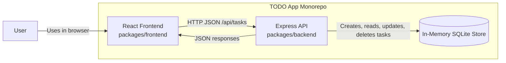

# Cloud Architecture Overview

This repository is a small full-stack monorepo with a browser-based React frontend, an Express API, and an in-memory data store used by the backend.

## System Context

## Notes

- The React frontend is the user-facing web application.
- The Express API exposes task endpoints under `/api/tasks`.
- Task data is stored in an in-memory SQLite database, so data is reset when the backend restarts.
- Both frontend and backend live in the same monorepo under `packages/frontend` and `packages/backend`.